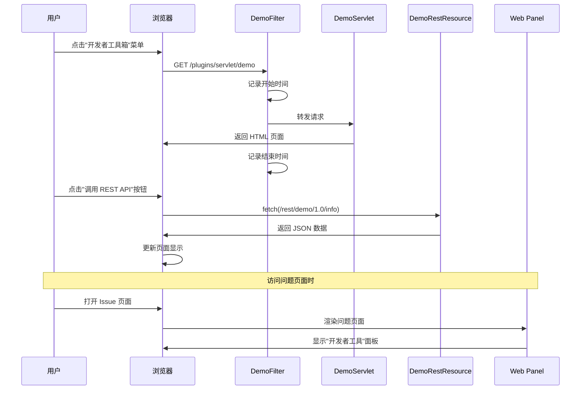

# jira开发

## 1 离线atlas-debug -o

Get-Content "F:\jira\atlassian-plugin\jiraLocalServer\target\jira\home\log\atlassian-jira.log" -Tail 200 | Select-String "ERROR" -\
Context 5读取错误日志

## 2 用户路径文件夹下（C:\Users\shadow light.m2）修改settings.xml配置仓库路径

```xml
<?xml version="1.0" encoding="UTF-8"?>
<settings xmlns="http://maven.apache.org/SETTINGS/1.0.0"
          xmlns:xsi="http://www.w3.org/2001/XMLSchema-instance"
          xsi:schemaLocation="http://maven.apache.org/SETTINGS/1.0.0 
          http://maven.apache.org/xsd/settings-1.0.0.xsd">
    
    <!-- 这里改成你想要的仓库路径，例如 D:\maven-repo -->
    <localRepository>F:/jira/repository</localRepository>
    
    <!-- 可选：配置国内镜像加速下载（例如阿里云镜像） -->
    <mirrors>
        <mirror>
            <id>aliyunmaven</id>
            <mirrorOf>central</mirrorOf>
            <name>阿里云公共仓库</name>
            <url>https://maven.aliyun.com/repository/public</url>
        </mirror>
    </mirrors>
    
</settings>
```

## 3 复制jar到localhost下安装且可以断点，需要在pom.xml中添加

```xml
<plugin>
                <groupId>org.apache.maven.plugins</groupId>
                <artifactId>maven-antrun-plugin</artifactId>
                <version>3.0.0</version>
                <executions>
                    <execution>
                        <id>copy-lib-src-webapps</id>
                        <phase>package</phase>
                        <configuration>
                            <target>
                                <!--服务插件的目录-->
                                <copy todir="F:\jira\atlassian-plugin\jiraLocalServer\target">
                                    <fileset dir="${basedir}/target/">
                                        <include name="test1-1.0.0-SNAPSHOT.jar" />
                                    </fileset>
                                </copy>
                            </target>
                        </configuration>
                        <goals>
                            <goal>run</goal>
                        </goals>
                    </execution>
                </executions>
            </plugin>
```

## 4 `atlassian-plugin.xml` 中**所有可注册模块**

### **🔌 核心功能扩展点（demo1）**

这些模块直接参与 Jira 的核心流程，用来改变或增强它处理事务的方式。

| **模块 (Module)**    | **作用**                                           | **就像...**                        |
| ------------------ | ------------------------------------------------ | -------------------------------- |
| `servlet`          | 注册一个标准的 Java Servlet，用来处理特定的 HTTP 请求，生成动态内容。     | 在 Jira 里造一个**客服窗口**，专门处理咨询。      |
| `servlet-filter`   | 注册一个过滤器，可以拦截并处理进出 Servlet 的请求和响应，比如做统一日志记录或权限校验。 | 公司大门的**保安**，所有访客（请求）都得经过他。       |
| `web-resource`     | 统一管理插件的静态资源，如 CSS、JavaScript 和图片文件。              | 一个**资源库**，存放你需要的所有零件。            |
| `web-item`         | 在 Jira 现有界面的菜单或按钮中添加新的链接。                        | 在导航栏的“**...**”菜单里，加上你的专属选项。      |
| `web-section`      | 在 Jira 界面上添加一个全新的区块或标签页。                         | 在项目主页里，新建一个独立的“**数据分析**”标签页。     |
| `rest`             | 为插件提供 REST API，实现前后端分离或供其他系统调用。                  | 给你的插件建一个**标准接口**，让手机 App 也能轻松访问。 |
| `component`        | 向 Jira 的组件系统注册一个可被其他插件或模块共享的组件。                  | 搭建一个**共享工具台**，所有同事都能借用上面的工具。     |
| `component-import` | 导入并使用 Jira 或其他插件提供的共享组件（`component`）。            | 从共享工具台**借用你需要的工具**。              |

### **👁️ 界面与视图**

这部分模块用来定制“看”信息的方式，改变 Jira 的外观和显示效果。

| **模块 (Module)**    | **作用**                           | **就像...**                    |
| ------------------ | -------------------------------- | ---------------------------- |
| `customfield-type` | 开发全新的自定义字段类型，满足特殊的业务数据存储需求。      | 一个**订制印章**，能往任务上盖任何你想要的信息。   |
| `report`           | 在 Jira 的“报告”菜单中添加自定义图表，提供专项数据分析。 | 一个**数据仪表盘**，能生成团队效率分析图。      |
| `gadget`           | 为 Jira 仪表盘添加可拖拽的小部件。             | 一个**智能小组件**，能放在手机桌面上直接看项目进展。 |
| `issue-tabpanel`   | 在查看问题（Issue）的页面，添加全新的标签页。        | 在任务详情页，多出一个“**关联文档**”的专属面板。  |
| `user-format`      | 自定义 Jira 中所有显示用户信息（头像、用户名）的方式。   | 一个**皮肤**，能决定同事名字和照片的展示风格。    |

### **⚙️ 工作流与自动化**

工作流是 Jira 的核心引擎，这类模块让你能深度定制它。

| **模块 (Module)**      | **作用**                                | **就像...**                        |
| -------------------- | ------------------------------------- | -------------------------------- |
| `workflow-condition` | 为工作流添加“条件”，决定一个流转（Transition）是否允许被执行。 | **门禁规则**：只有主任工程师才能操作“批准发布”。      |
| `workflow-validator` | 为工作流添加“验证器”，在用户执行操作前，校验输入的信息是否合规。     | **表单审核**：必须填写“预计工时”才能进入“开发中”。    |
| `workflow-function`  | 为工作流添加“后处理函数”，在流程执行后自动触发自定义逻辑。        | **流水线**：任务完成后，自动给相关人员发送邮件通知。     |
| `jqlfunction`        | 为 Jira 的高级搜索（JQL）增加新的函数。              | 让你的专属**搜索语法**，能搜出“上季度我标记过的所有任务”。 |

### **🧱 其他高级模块**

这些模块提供了更深层次、更灵活的集成能力。

| **模块 (Module)**                         | **作用**                                                | **就像...**                    |
| --------------------------------------- | ----------------------------------------------------- | ---------------------------- |
| `module-type`                           | 这种模块极其强大，它可以动态地为插件框架本身**注册一个全新的模块类型**，极大拓展了系统的可能性。    | 一种**改变规则的规则**，让你能发明全新的插件零件。  |
| `servlet-context-listener`              | 注册一个 `ServletContextListener`，可以在插件或整个应用启动、关闭时执行特定代码。 | 一个**自动守卫**，应用一启动，它就自动开始工作。   |
| `servlet-context-param`                 | 为插件的 Servlet、过滤器等设置共享的上下文初始化参数。                       | 给共享工具台设置一个**公告板**，上面有全局配置信息。 |
| `rpc-soap` **/** `rpc-xmlrpc` | 部署一个 SOAP 或 XML-RPC 服务，这是较老的远程调用方式。                   | 一个**老式电话亭**，外部系统能通过它拨入 Jira。 |

### 4.1 demo1


